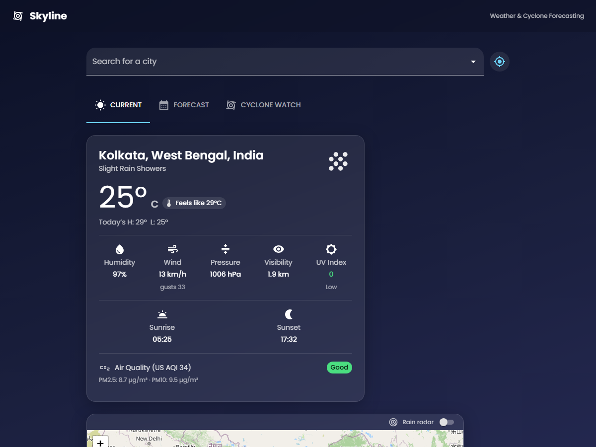
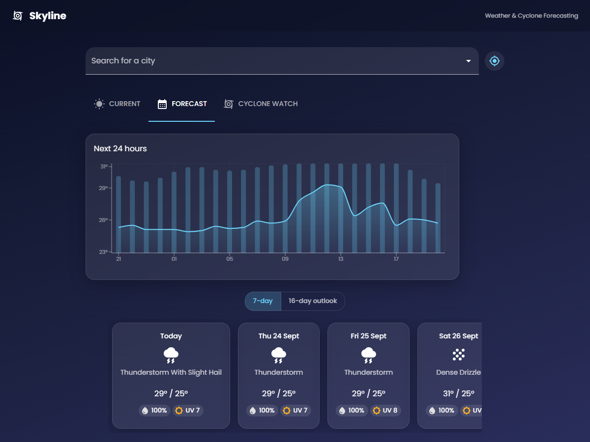
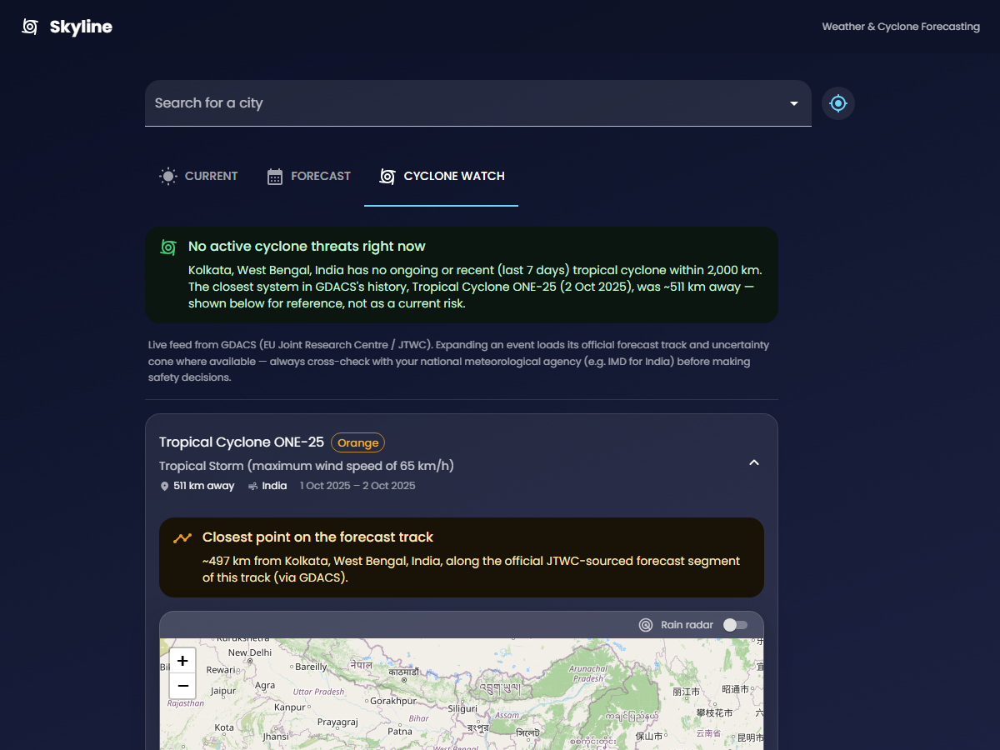

# 🌪️ Skyline — Weather & Cyclone Forecasting

A weather forecasting web app with a live tropical-cyclone watch feature —
built with **React**, **Vite**, and **Material UI**. It runs entirely on
free, keyless APIs, so it needs **zero secrets** to run or deploy.

**🔗 Live app:** [weather-app-olive-beta-55.vercel.app](https://weather-app-olive-beta-55.vercel.app/)

<p align="center">
  
  
</p>
<p align="center">
  
</p>

---

## ✨ Features

### ☀️ Current conditions
- Temperature, feels-like, humidity, wind speed & gusts, pressure, visibility
- UV Index with a colour-coded risk category
- Live Air Quality (US AQI, PM2.5, PM10)
- Sunrise / sunset times
- An interactive map centred on the searched location, with a toggleable
  **live rain radar** overlay (via RainViewer)

### 📅 Forecast
- Hourly temperature & precipitation-probability chart (next 24h)
- 7-day or 16-day daily outlook, each with a UV badge and rain chance

### 🌀 Cyclone Watch
- Live tropical-cyclone alerts sourced from **GDACS** (EU Joint Research
  Centre), with real-time distance from your searched location
- When a system has an active advisory, its **official JTWC-sourced
  forecast track** and **uncertainty cone** are plotted on the map
- Honest, recency-aware framing — a storm from months ago is never shown
  as a live threat

### 📍 Location search
- Autocomplete city search, or "use my location" (with reverse geocoding
  to a real place name)

---

## 🧰 Tech stack

| Layer | Choice |
|---|---|
| UI framework | React 19 + Vite |
| Components | Material UI (MUI) |
| Charts | Recharts |
| Maps | Leaflet + React-Leaflet |
| Hosting | Vercel (static site + serverless functions) |

## 🌐 Data sources — all free, no API key required

| Source | Used for |
|---|---|
| [Open-Meteo](https://open-meteo.com/) | Current conditions, hourly/daily forecast, air quality, geocoding |
| [GDACS](https://www.gdacs.org/) | Live tropical-cyclone events and official forecast-track geometry |
| [RainViewer](https://www.rainviewer.com/) | Live precipitation radar tiles |
| [BigDataCloud](https://www.bigdatacloud.com/) | Reverse geocoding for "use my location" |

GDACS doesn't send CORS headers, so it's proxied instead of called directly
from the browser:
- **locally**, by the Vite dev-server proxy (`vite.config.js`)
- **in production**, by the Vercel serverless functions in [`/api`](api)

---

## 🚀 Getting started

```bash
npm install
npm run dev
```

The app opens at `http://localhost:5173`. No `.env` file or API keys needed.

## ☁️ Deploying to Vercel

No environment variables required — this stack has no secrets.

1. Push this repo to GitHub.
2. In Vercel, **Add New Project** → import the repo. Vercel auto-detects the
   Vite preset (build command `vite build`, output `dist`).
3. Deploy. The `/api/cyclone` and `/api/cyclone-track` routes are picked up
   automatically as serverless functions — no extra config needed.

Or from the CLI:

```bash
npx vercel
```

---

## ⚠️ A note on cyclone data

GDACS gives the latest recorded position for each system, and, when a storm
has an active advisory, its official forecast track and uncertainty cone
(sourced from JTWC). It is **not** a substitute for your national
meteorological agency's warnings — e.g. [IMD](https://mausam.imd.gov.in/)
for India — always defer to official alerts for safety decisions.

---

## 👤 Author

**Sneha Kar** — [@Sneha-Kar2005](https://github.com/Sneha-Kar2005)
